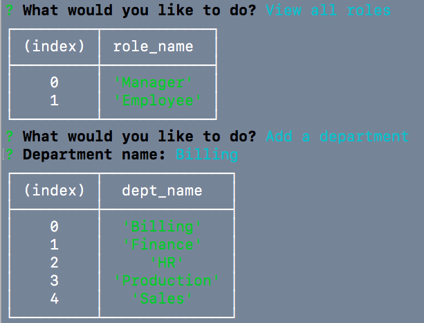
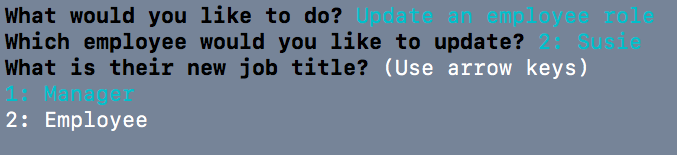

# Employee Tracker

## Getting Started

This is a CLI application that allows the user to view departments, roles, and employees in a given database. The user is also able to add new departments, roles, and employees, and update existing employee roles. 

### Prerequisites
* [Node](https://nodejs.org/en/)
* [MySql](https://dev.mysql.com/doc/)

### Installing

* Clone repository
* Go to repository folder via terminal or bash
* Run 'npm install'
* Run 'mysql -u root -p' and enter credentials
* Run 'source db/schema.sql'
* Run 'source db/seeds.sql'
* Quit mysql
* Run 'node server.js'
* The user will then be prompted to choose different options and run the application
* Watch video [here](https://youtu.be/sBln5avzD1Y)

  
  

## Built With

* [HTML](https://developer.mozilla.org/en-US/docs/Web/HTML)
* [Javascript](https://developer.mozilla.org/en-US/docs/Web/JavaScript)
* [JQuery](https://developer.mozilla.org/en-US/docs/Glossary/jQuery)
* [Node](https://nodejs.org/en/)
* [MySql](https://dev.mysql.com/doc/)
* [Inquirer](https://www.npmjs.com/package/inquirer)

## Author

**Courtney Foster** 

- [Link to Portfolio Site](https://cfoster121.github.io/portfolio/)
- [Link to Github](https://github.com/cfoster121)
- [Link to LinkedIn](https://www.linkedin.com/in/courtney-foster-0b364575/)

## License

This project is licensed under the MIT License 

## Acknowledgments

* [W3 Schools](https://www.w3schools.com/)
* [MDN Web Docs](https://developer.mozilla.org/en-US/)
* TA sessions
